## UML Class diagram showing the interfaces and classes involved in reading, parsing and transforming content of the XML-files into the actual data model.

The exact definition of the _Election_ class depends on the datamodel that is being used.
It only serves here as an example how an instance can be used by providing it to the transformers. 

```mermaid

classDiagram

namespace org_xml_sax_helpers {
    class DefaultHandler {
        +startElement(String, String, String, Attributes) void
        +characters(char[], int, int) void
        +endElement(String, String, String, Attributes) void
    }
}

namespace javax_xml_parser {
    class SAXParser {
        +parse(DefaultHandler) void
    }
}

namespace nl_hva_ict_sm3_backend_utils_xml { 
    
    class Election
    class TagAndAttributeNames {
        <<interface>>
    }

    class DefinitionTransformer {
        <<interface>>
        +registerRegion(Map~String, String~) void
        +registerParty(Map~String, String~) void
    }

    class CandidateTransformer {
        <<interface>>
        +registerCandidate(Map~String, String~) void
    }

    class VotesTransformer {
        <<interface>>
        +registerPartyVotes(boolean, Map~String, String~) void
        +registerCandidateVotes(boolean, Map~String, String~) void
        +registerMetadata(boolean, Map~String, String~) void
    }

    class EMLHandler {
        +startElement(String, String, String, Attributes)
        +characters(char[], int, int)
        +endElement(String, String, String, Attributes)
    }

    class DutchElectionParser {
        -DefinitionTransformer definitionTransformer
        -CandidateTransformer candidateTransformer
        -VotesTransformer resultTransformer
        -VotesTransformer nationalVotesTransformer
        -VotesTransformer constituencyVotesTransformer
        -VotesTransformer municipalityVotesTransformer
        +DutchElectionParser(DefinitionTransformer, CandidateTransformer, VotesTransformer, VotesTransformer, VotesTransformer, VotesTransformer)
        +parseResults(String, String) void
        )
    }

    class DutchDefinitionTransformer {
        -Election
        DutchDefinitionTransformer(Election)
    }
    
    class DutchCandidateTransformer {
        -Election
        DutchCandidateTransformer(Election)
    }
    
    class DutchResultTransformer {
        -Election
        DutchResultTransformer(Election)
    }
    
    class DutchNationalVotesTransformer {
        -Election
        DutchNationalVotesTransformer(Election)
    }
    
    class DutchConstituencyTransformer {
        -Election
        DutchConstituencyTransformer(Election)
    }
    
    class DutchMunicipalityVotesTransformer {
        -Election
        DutchMunicipalityVotesTransformer(Election)
    } 
}

    EMLHandler <|-- DefaultHandler
    EMLHandler <|.. TagAndAttributeNames

    EMLHandler <-- SAXParser : uses
    SAXParser <-- DutchElectionParser : uses

    DutchDefinitionTransformer ..|> DefinitionTransformer
    DutchCandidateTransformer ..|> CandidateTransformer
    DutchResultTransformer ..|> VotesTransformer
    DutchNationalVotesTransformer ..|> VotesTransformer
    DutchConstituencyTransformer ..|> VotesTransformer
    DutchMunicipalityVotesTransformer ..|> VotesTransformer

    DutchDefinitionTransformer <-- EMLHandler : calls
    DutchCandidateTransformer <-- EMLHandler : calls
    DutchResultTransformer <-- EMLHandler : calls
    DutchNationalVotesTransformer <-- EMLHandler : calls
    DutchConstituencyTransformer <-- EMLHandler : calls
    DutchMunicipalityVotesTransformer <-- EMLHandler : calls

```

_Please note that in the class diagram the underscores in the package names repace the period's of the actual package names. The code that creates a DutchElectionParser is responsible for creating an instance of the Election class and use that instance when creating the transformers._
