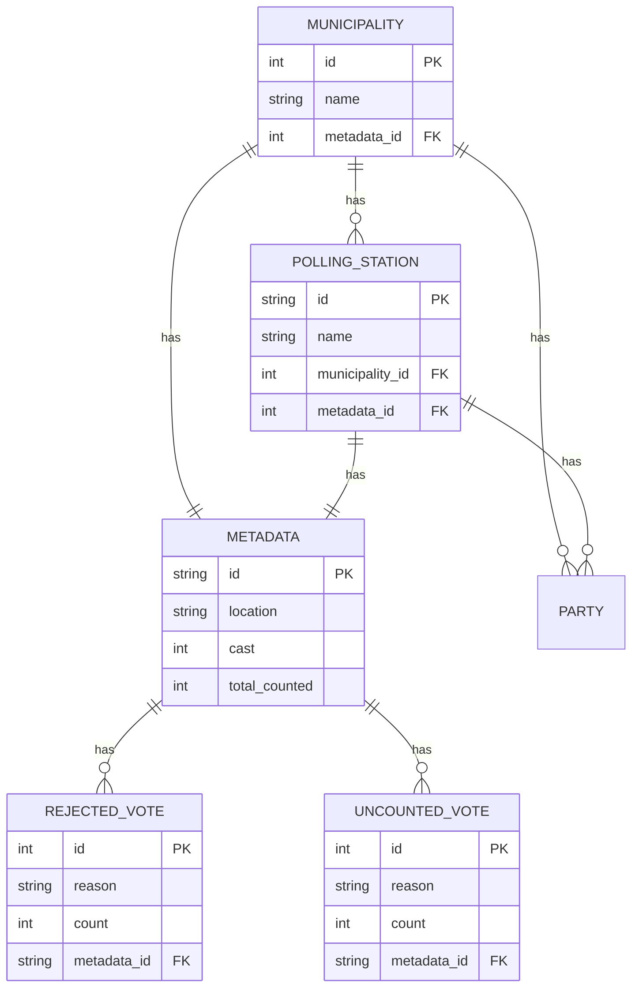

# EERD

```mermaid
    erDiagram
    MUNICIPALITY {
        int id PK
        string name
        int metadata_id FK
    }
    POLLING_STATION {
        string id PK
        string name
        int municipality_id FK
        int metadata_id FK
    }
    METADATA {
        string id PK
        string location
        int cast
        int total_counted
    }
    REJECTED_VOTE {
        int id PK
        string reason
        int count
        string metadata_id FK
    }
    UNCOUNTED_VOTE {
        int id PK
        string reason
        int count
        string metadata_id FK
    }
    PARTY {
    }

    MUNICIPALITY ||--o{ POLLING_STATION: has
    MUNICIPALITY ||--|| METADATA: has
    MUNICIPALITY ||--o{ PARTY: has
    POLLING_STATION ||--|| METADATA: has
    POLLING_STATION ||--o{ PARTY: has
    METADATA ||--o{ REJECTED_VOTE: has
    METADATA ||--o{ UNCOUNTED_VOTE: has
   

```